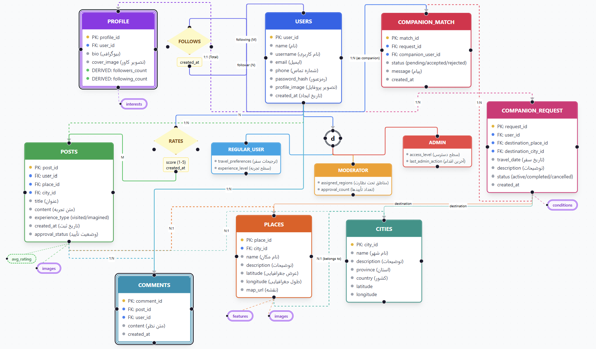

# 📄 Phase 2: Logical Database Design (طراحی منطقی پایگاه داده)

## 1. Introduction
This document presents the **Logical Relational Schema** for the "Hamsafar Mirza" system. It is derived from the Conceptual EER model designed in Phase 1. The schema is normalized to the Third Normal Form (3NF) to ensure data integrity and minimize redundancy.

---

## 2. Relational Schema (Standard Notation)

The following schema represents the logical structure of the database.
*   **Legend**: <u>**Primary Key**</u>, *Foreign Key*, [Multi-valued Attribute Table]

### 2.1. User Management System
*   **USERS** (<u>**user_id**</u>, name, username, email, phone, password_hash, profile_image, created_at, user_type)
    *   *Note*: `user_type` is the discriminator for the disjoint specialization.
*   **REGULAR_USERS** (<u>**user_id***</u>, travel_preferences, experience_level)
*   **MODERATORS** (<u>**user_id***</u>, assigned_regions, approval_count)
*   **ADMINS** (<u>**user_id***</u>, access_level, last_admin_action)
*   **PROFILES** (<u>**profile_id**</u>, *user_id*, bio, cover_image)
*   **PROFILE_INTERESTS** (<u>**profile_id***, **interest**</u>)
*   **FOLLOWS** (<u>**follower_id***, **following_id***</u>, created_at)

### 2.2. Content System
*   **POSTS** (<u>**post_id**</u>, *user_id*, *place_id*, *city_id*, title, content, experience_type, approval_status, created_at)
*   **POST_IMAGES** (<u>**post_id***, **image_url**</u>)
*   **COMMENTS** (<u>**comment_id**</u>, *post_id*, *user_id*, content, created_at)
*   **RATINGS** (<u>**user_id***, **post_id***</u>, score, created_at)

### 2.3. Location System
*   **CITIES** (<u>**city_id**</u>, name, description, province, country, latitude, longitude)
*   **PLACES** (<u>**place_id**</u>, *city_id*, name, description, latitude, longitude, map_url)
*   **PLACE_FEATURES** (<u>**place_id***, **feature**</u>)
*   **PLACE_IMAGES** (<u>**place_id***, **image_url**</u>)

### 2.4. Companion System
*   **COMPANION_REQUESTS** (<u>**request_id**</u>, *user_id*, *destination_place_id*, *destination_city_id*, travel_date, description, status, created_at)
*   **REQUEST_CONDITIONS** (<u>**request_id***, **condition**</u>)
*   **COMPANION_MATCHES** (<u>**match_id**</u>, *request_id*, *companion_user_id*, status, message, created_at)

---

## 3. Normalization Analysis (3NF)

We assert that all relations satisfy **Third Normal Form (3NF)**:

1.  **1NF (Atomic Values)**:
    *   All attributes are atomic.
    *   Multi-valued attributes from the EER model (e.g., `interests`, `images`, `features`) have been extracted into separate tables (e.g., `PROFILE_INTERESTS`).

2.  **2NF (Full Functional Dependency)**:
    *   All tables have a single-attribute Primary Key (UUID), so partial dependencies are impossible.
    *   For composite key tables (like `RATINGS` or `FOLLOWS`), non-key attributes (like `score` or `created_at`) depend on the *entire* key tuple, not just a part of it.

3.  **3NF (No Transitive Dependency)**:
    *   All non-key attributes depend *only* on the Primary Key.
    *   *Analysis of `POSTS`*: `POSTS` contains both `place_id` and `city_id`. While `place` determines `city`, we explicitly encompass both to allow posts about a city *without* a specific place. Thus, `city_id` is not transitively dependent when `place_id` is NULL; it is a direct attribute of the post's context.

---

## 4. EER to Relational Mapping Rules Used

The transformation followed standard algorithm steps:

1.  **Strong Entities**: Mapped directly to tables (e.g., `USERS`, `PLACES`).
2.  **Weak Entities**: Mapped to tables including the owner's PK as FK (e.g., `PROFILES`, `COMMENTS`).
3.  **1:N Relationships**: FK placed in the "Many" side (e.g., `user_id` in `POSTS`).
4.  **M:N Relationships**: Mapped to new association tables (e.g., `RATINGS`, `FOLLOWS`).
5.  **Multi-valued Attributes**: Mapped to new tables with composite PK (e.g., `PLACE_FEATURES`).
6.  **Specialization**:
    *   **Strategy**: "Class Table Inheritance" (or Table-per-Type).
    *   **Reason**: Since the specialization is Disjoint and Total, and subtypes have distinct attributes, creating separate tables (`REGULAR_USERS`, etc.) linked by `user_id` is the cleanest approach for data integrity and storage efficiency.

---

## 5. Integrity Constraints

*   **Entity Integrity**: All tables possess a `PRIMARY KEY` that cannot be NULL.
*   **Referential Integrity**: All `FOREIGN KEY`s reference existing valid records. `ON DELETE CASCADE` is applied to dependent weak entities (Profile, Comments) to prevents orphans.
*   **Domain Integrity**:
    *   `score`: CHECK (1 <= score <= 5)
    *   `status`: CHECK IN ('active', 'completed', 'cancelled')
    *   `experience_type`: CHECK IN ('visited', 'imagined')

---

*This document serves as the formal deliverable for Phase 2: Logical Design.*

---

## Appendix: Phase 1 EER Diagram

The following EER model was used as the basis for this logical design:

